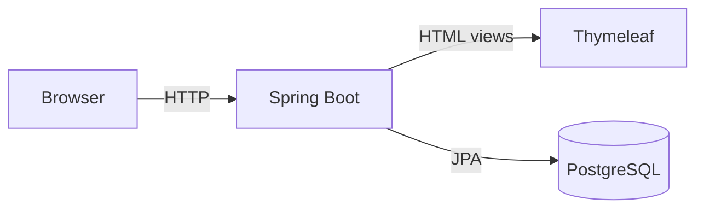
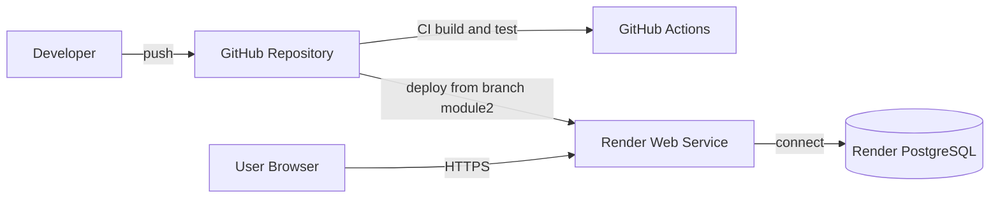

# Resource Booking System

Web application for managing shared resources and handling booking requests
(e.g. rooms, desks, laboratories).

The project was developed incrementally across two exam modules.
This repository contains the extended version required for **Module 2**,
including Docker, CI/CD and cloud deployment.

---

## Architecture Overview

### Application Architecture


### CI/CD and Deployment Architecture


---

## Technologies
- Java 21
- Spring Boot
- Thymeleaf
- PostgreSQL
- Docker & Docker Compose
- GitHub Actions (CI)
- Render (Cloud Deployment)

---

## Main Functionalities

- Creation, listing, update and deletion of shared resources (e.g. rooms, desks, laboratories)
- Creation and listing of users
- Creation and cancellation of bookings
- Availability check for a resource in a given time interval
- Conflict prevention: overlapping confirmed bookings for the same resource are rejected
- Web interface for manual interaction and demo, plus REST endpoints for programmatic access
- Persistent storage on PostgreSQL

---

## Design Choices

- **Layered architecture**: controllers, services and repositories are separated to keep responsibilities clear and the code easier to maintain.
- **Spring Boot + JPA**: chosen to simplify application configuration, persistence management and integration with PostgreSQL.
- **Thymeleaf web UI**: a lightweight server-side interface was added to make the system immediately usable during demo and oral presentation, without requiring a separate frontend.
- **REST API exposure**: the main resources of the system are also available through REST endpoints, making the project usable both as a web application and as a backend service.
- **Conflict handling in the service layer**: booking validation and overlap checks are enforced in the business logic, so rules are applied consistently regardless of whether requests come from the UI or the API.
- **Containerized execution**: Docker and Docker Compose were adopted to make the project reproducible from scratch and easier to run in different environments.
- **Cloud deployment**: Render was used to deploy the application and a managed PostgreSQL database, in order to provide a public running version of the system.

---

## Run Locally (Docker)

See detailed instructions:
- `docs/guide/local-run.md`

Quick start:
```bash
git clone https://github.com/andreapupilli/resource_booking_system.git
cd resource_booking_system
git checkout module2
docker compose up --build
```

Open:
- http://localhost:8080

---

## CI/CD Pipeline

The project uses GitHub Actions to automatically build and test the application.

Details:
- `docs/guide/ci-cd.md`

---

## Cloud Deployment

The application is deployed on **Render** as a Docker-based Web Service.

- Live URL:  
  https://resource-booking-system-jjvs.onrender.com

Deployment details:
- `docs/guide/deploy-render.md`

---

## Database

- Managed PostgreSQL instance on Render
- Connection parameters are provided via environment variables

---

## Repository Structure

```
.github/workflows/ci.yml   # CI pipeline
docs/
  diagrams/               # Architecture diagrams
  guide/                  # Local run, CI/CD, deployment guides
src/                       # Application source code
docker-compose.yml
Dockerfile
```

---

## Test Commands

The project uses the Maven Wrapper, so Maven does not need to be installed globally.

Run tests:

Linux / macOS:
```bash
./mvnw test
```

Windows:
```bash
mvnw.cmd test
```

Run the full verification lifecycle:

Linux / macOS:
```bash
./mvnw verify
```

Windows:
```bash
mvnw.cmd verify
```

Tests are executed using the `test` profile and rely on an in-memory H2 database, so PostgreSQL is not required for running tests locally.

---

## Exam Notes

- **Module 1** submission corresponds to tag: `module1-final`
- **Module 2** is developed on branch: `module2`
- The project is cloud-native, containerized, and fully reproducible from scratch
