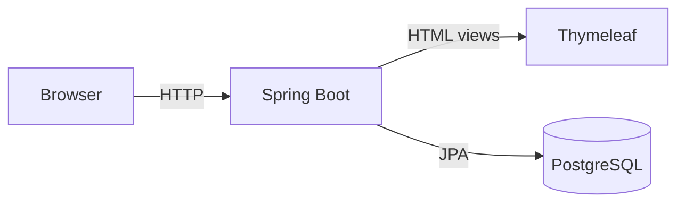
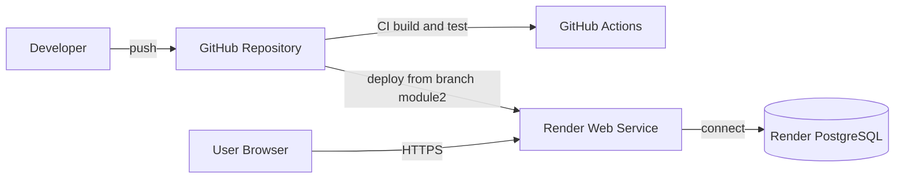

# Resource Booking System

<<<<<<< HEAD
Applicazione web per la gestione e la prenotazione di risorse condivise
(es. aule, scrivanie, laboratori).

Il progetto è stato sviluppato come parte di due moduli d’esame distinti
ed è stato esteso progressivamente mantenendo un’unica repository.

---

## Project Structure – Exam Modules

Questa repository contiene lo **stesso progetto** sviluppato in due fasi:

### Module 1
Implementazione base del sistema di prenotazione:
- modello di dominio
- API REST
- persistenza su database
- interfaccia web server-side
=======
Web application for managing and booking shared resources
(e.g. rooms, desks, laboratories).
>>>>>>> module2

The project was developed incrementally across two exam modules.
This repository contains the extended version required for **Module 2**,
including Docker, CI/CD and cloud deployment.

---

## Architecture Overview

### Application Architecture


### CI/CD and Deployment Architecture


---

## Technologies
- Java 21
- Spring Boot
- Thymeleaf
- PostgreSQL
- Docker & Docker Compose
- GitHub Actions (CI)
- Render (Cloud Deployment)

<<<<<<< HEAD
## Avvio
- Configurare il database PostgreSQL
- Avviare l'applicazione Spring Boot
- Accedere a http://localhost:8080

📌 **Riferimento Git**
- Tag: `module1-final`

Per visualizzare lo stato consegnato per il Modulo 1:
```bash
git checkout module1-final
=======
---

## Run Locally (Docker)

See detailed instructions:
- `docs/guide/local-run.md`

Quick start:
```bash
git clone https://github.com/andreapupilli/resource_booking_system.git
cd resource_booking_system
git checkout module2
docker compose up --build
```

Open:
- http://localhost:8080

---

## CI/CD Pipeline

The project uses GitHub Actions to automatically build and test the application.

Details:
- `docs/guide/ci-cd.md`

---

## Cloud Deployment

The application is deployed on **Render** as a Docker-based Web Service.

- Live URL:  
  https://resource-booking-system-jjvs.onrender.com

Deployment details:
- `docs/guide/deploy-render.md`

---

## Database

- Managed PostgreSQL instance on Render
- Connection parameters are provided via environment variables

---

## Repository Structure

```
.github/workflows/ci.yml   # CI pipeline
docs/
  diagrams/               # Architecture diagrams
  guide/                  # Local run, CI/CD, deployment guides
src/                       # Application source code
docker-compose.yml
Dockerfile
```

---

## Exam Notes

- **Module 1** submission corresponds to tag: `module1-final`
- **Module 2** is developed on branch: `module2`
- The project is cloud-native, containerized, and fully reproducible from scratch
>>>>>>> module2
